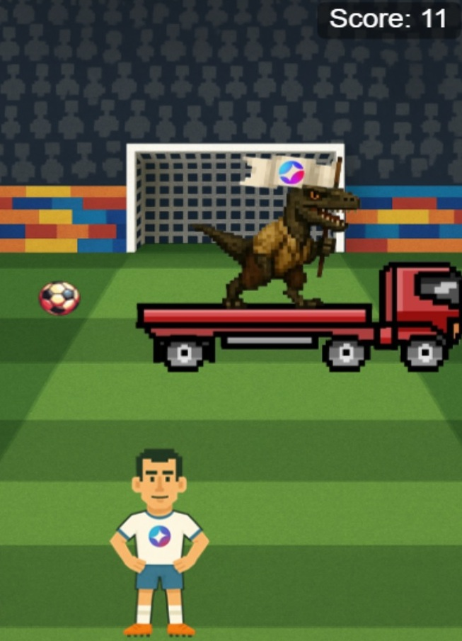

# Somnia Football

**Somnia Football** is a browser-based arcade game where the player controls a footballer whose goal is to kick the ball as many times as possible. But beware! Various obstacles will try to stop you: a crow dropping bricks, a UFO that abducts the ball and then drops it randomly, and a teleport that takes the ball away and returns it in a different location.

## Platform  
The game is available only in the browser. The mobile version is not supported yet.

## How to Play  
1. Connect your crypto wallet (e.g., RabbyWallet or MetaMask).  
2. Press the **Start** button to begin the game.  
3. Control the footballer using the arrow keys to move across the field and kick the ball.

## Controls  
⬅️ Left Arrow — move left  
➡️ Right Arrow — move right

Try to avoid obstacles and kick the ball as many times as you can!

